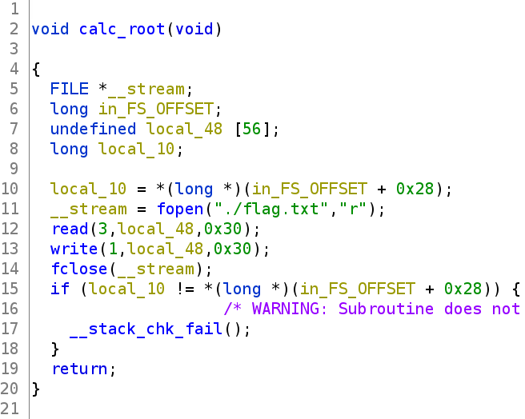
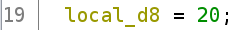
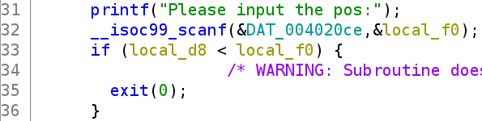
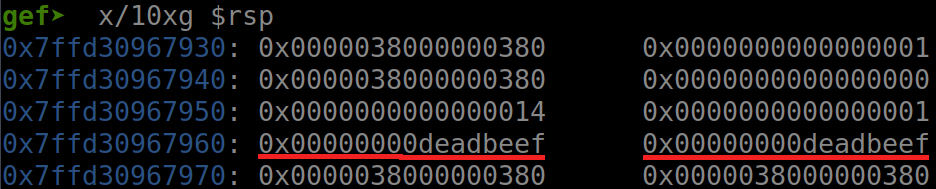
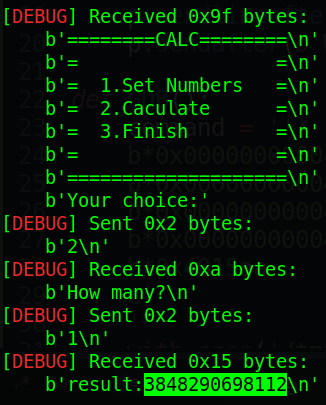
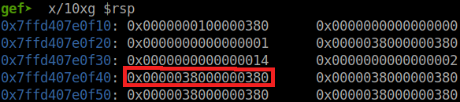
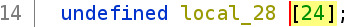
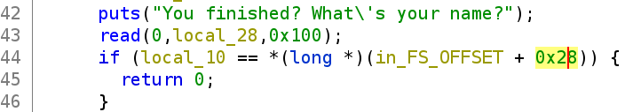
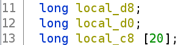
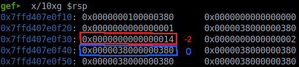

# mocsctf2022.mocsctf.com - calc

Origin challenge link: https://mocsctf2022.mocsctf.com/challenges

You can also download challenge in my repo: [calc.zip](calc.zip)

There is 1 file in zip:

- calc

Download the file and let's start!

# 1. Find bug

First, we use `file` to check for basic information:

```
$ file calc

calc: ELF 64-bit LSB executable, x86-64, version 1 (SYSV), dynamically linked, interpreter /lib64/ld-linux-x86-64.so.2, BuildID[sha1]=ea3703cc9b093c54402a5461acb0d88249d219f0, for GNU/Linux 3.2.0, not stripped
```

Wonderful! This is a 64-bit file without being stripped. This will be helpful when we debug our program. Next, we will use `checksec` to check all the security of file:

```
$ checksec calc
    Arch:     amd64-64-little
    RELRO:    Partial RELRO
    Stack:    Canary found
    NX:       NX enabled
    PIE:      No PIE (0x400000)
```

When can see that there is canary on stack and no PIE. That's all we can get for checksec. Finally, we will use ghidra to decompile the challenge file to get the flow.

Looking at all the functions, we can see that there is an interesting function named `calc_root`:



It will read and print out the flag for us. Very interesting! And another essential function is main().

The first thing in main() we can see is that with the first option `Set Numbers`, it get the position **without checking if it's a negative number or not** and compare with `local_d8` which containing `20`:





Then it take this pos variable, add `local_c8` and scanf():


In GDB with index 0 and 1, it will be like this:



But we can set number within (-oo ; 20] so that's the first bug.

The next option is `Calculate`, it get our input, then sum all data on stack from index 0 to our input and print out the final value:


So with index 1, it will work like this:



That's the data on stack:



Nothing we can get but just know how to leak stack data. 

And the last option is `Finish`, which is defined with just 24 char space:



But we can input upto 0x100 byte:



So that means **Buffer Overflow** and we have a `ret` right after our input. But there is canary on stack and how can we deal with it? We will try to leak it as the next part describes.

That's all we found. Let's move on next part: Brainstorming!

# 2. Brainstorming

We know that with the first option, we can change all the data, on stack, we want. Luckily, we can see that `local_c8`, which we `input the number` of option 1, is after `local_d8`, which contain 20 (0x14) to check if our index is larger than 20 or not



So we will change `local_d8` from 20 to a larger number so that when we get value on stack, we can get more than 20 index. Hence, we leak the canary value. And with **buffer overflow** in the `Finish` option, we control the rip to make it print out the flag.

- Summary:
  1. Leak stack canary
  2. Get flag

# 3. Exploit

Before we start our exploitation, I write those function to make our exploitation easier

<details>
<summary></summary>
<p>

```
def setnumber(pos, number):
	p.sendlineafter(b'choice:', b'1')
	p.sendlineafter(b'Please input the pos:', '{}'.format(pos).encode())
	p.sendlineafter(b'Please input the number:', '{}'.format(number).encode())

def calculate(many):
	p.sendlineafter(b'choice:', b'2')
	p.sendlineafter(b'How many?\n', '{}'.format(many).encode())
	# Result receive outside

def finish(data):
	p.sendlineafter(b'choice:', b'3')
	p.sendafter(b'What\'s your name?', data)
```

</p>
</details>

And now, we start!

### Stage 1: Leak stack canary

First, we will change the maximum of index from 20 to 0x100 with the `Set Number` option. Having a look in GDB, we know that the index which point to max index variable is `-2`:



### Stage 2: Get flag

# 4. Get flag